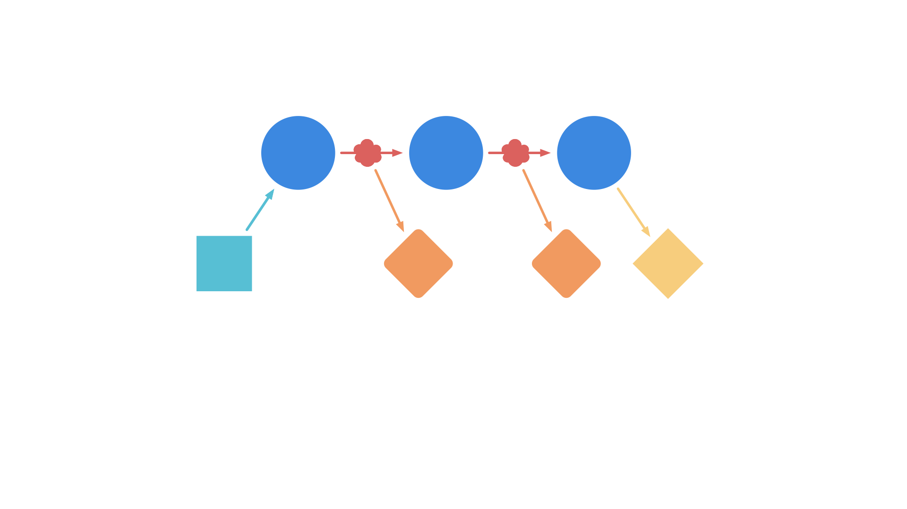
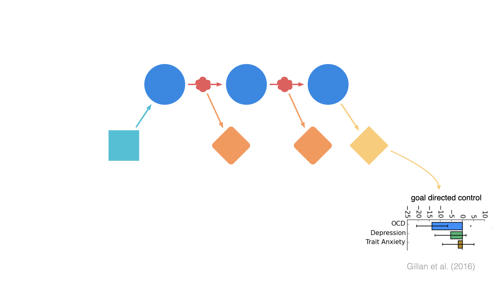
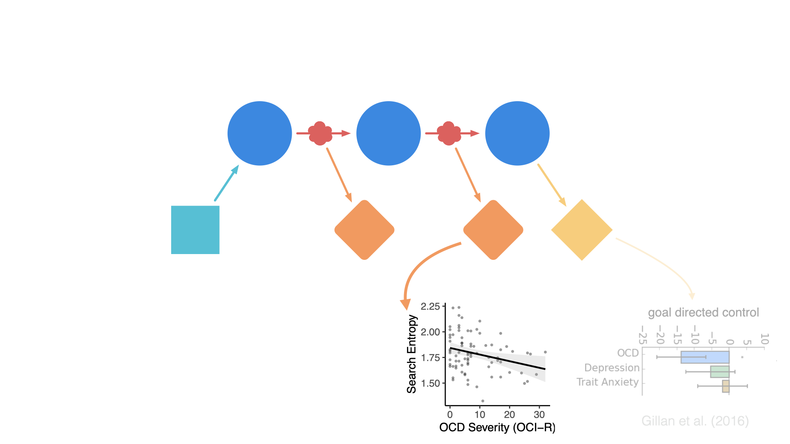
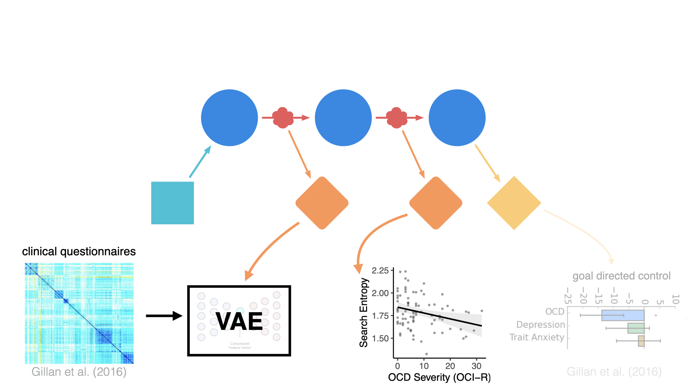

# cognition as action

Fred Callaway

NYU & Harvard

<Box w30 l100 b19 tilt text-dartmouth border-dartmouth text-lg>
  starting fall '26
  Dartmouth!
</Box>

---
src: ./pages/intro/intro.md
hide: false
---

---

<Outline click/>

---

<Outline at=1 />

---
src: ./pages/theory/theory.md
hide: false
---

---

<OutlineTransition at=2 />

---
src: ./pages/attention/attention.md
hide: false
---

---
src: ./pages/memory/memory.md
hide: false
---
---

<OutlineTransition at=3 />

---
src: ./pages/planning/planning.md
hide: false
---

---
src: ./pages/planning22/planning22.md
hide: false
---
---

<OutlineTransition at=4 />

---
src: ./pages/eyeplan/eyeplan.md
hide: false
---

---

## what next?

---
src: ./pages/zhuojun/zhuojun.md
---

---

# Learning representations for planning

<Profile name="Sixing Chen" src="/people/sixing.png" />

---

# Learning representations for planning

<Profile name="Sixing Chen" src="/people/sixing.png" />

<Pointer x=110 y=46 rot=-1 v-click/>

<Box text-sm r5 b2 w31 tilt-l shadow-xl v-click>
  predecessor representation?
</Box>

---

# Data-driven computational psychiatry

<Switch>
  
  
  
  
</Switch>

  ^
  process

---

## come work with me!

  
  _and these cool folks too!_
  
  

    

      
      
Jonathan Phillips

    

    

      
      
Steven Frankland

    

  

fredcallaway@gmail.com

---

### thanks!

fredcallaway@gmail.com

