# A rational model of perceived control, negative thinking, and avoidance {.text-4xl!.translate-y-3}

<NonLocal r5 t5 text-sm text-right text-teal-500 force>

  **scroll** or **←**/**→** to navigate
  
  **↑**/**↓** skips animations

  **g** for search

  **o** for overview
</NonLocal>

Fred Callaway  
NYU & Harvard{.text-base}

---

<!--  -->

make a new friend?

finally talk to Jesse?

drink too much?

throw up on the host?!

::background::

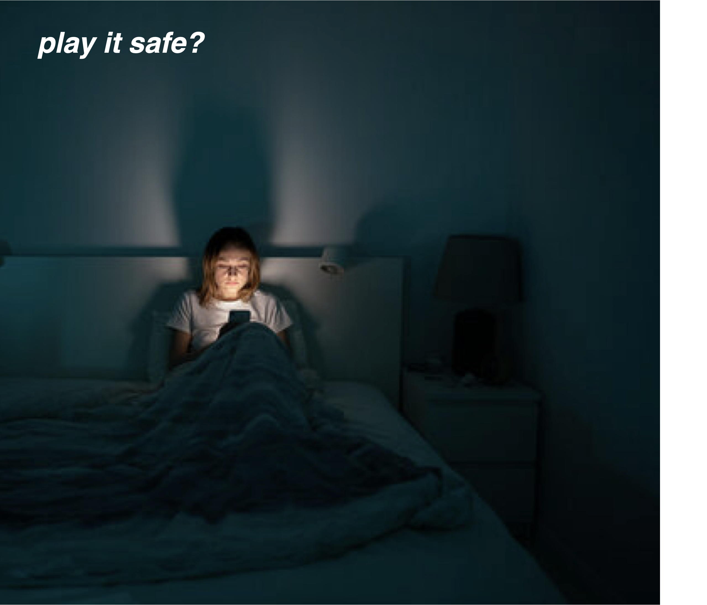

---

<Switch>
  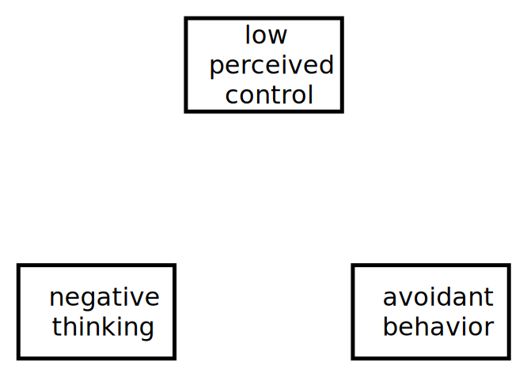
  
  

    

      
Huys & Dayan (2009)

      
Seligman & Maier (1967)

      
De Raedt & Hooley (2016)

      
Russek et al. (2025)

      
Zorowitz et al. (2020)

      
Gagne & Dayan (2022)

      
Gallagher et al. (2014)

      
Huys et al. (2015)

      
Bandura (1997)

      
Moscarello & Hartley (2017)

      
Granwald et al. (2025)

      
Hartstra et al. (yesterday)

    

    
  

  

  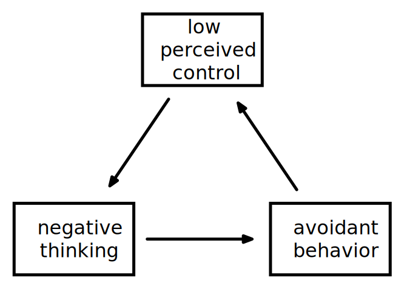
</Switch>

---

<Switch>
  <Questions question=0 answer=0 />
  <Questions question=1 answer=0 />
  <Questions question=2 answer=0 />
  <Questions question=3 answer=0 />
  <Questions question=3 answer=0 highlight=1 />
</Switch>

---

# People think about bad things

  <fig v-click caption="Christianson & Loftus (1987)" cite>
    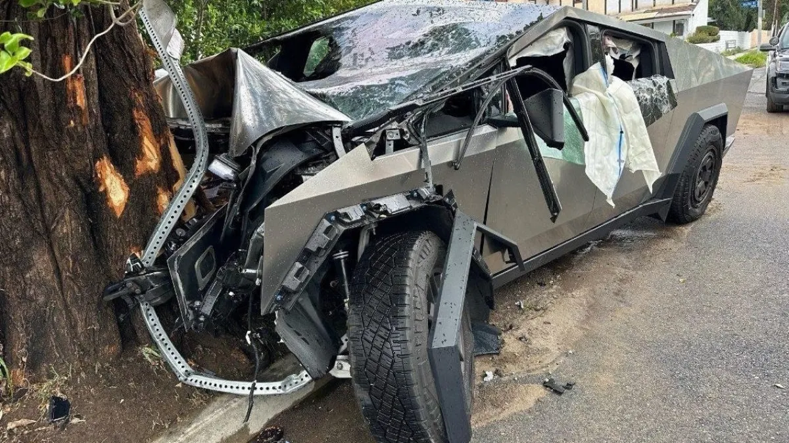
  </fig>
  <fig v-click caption="Sunstein & Zeckhauser (2011)" cite>
    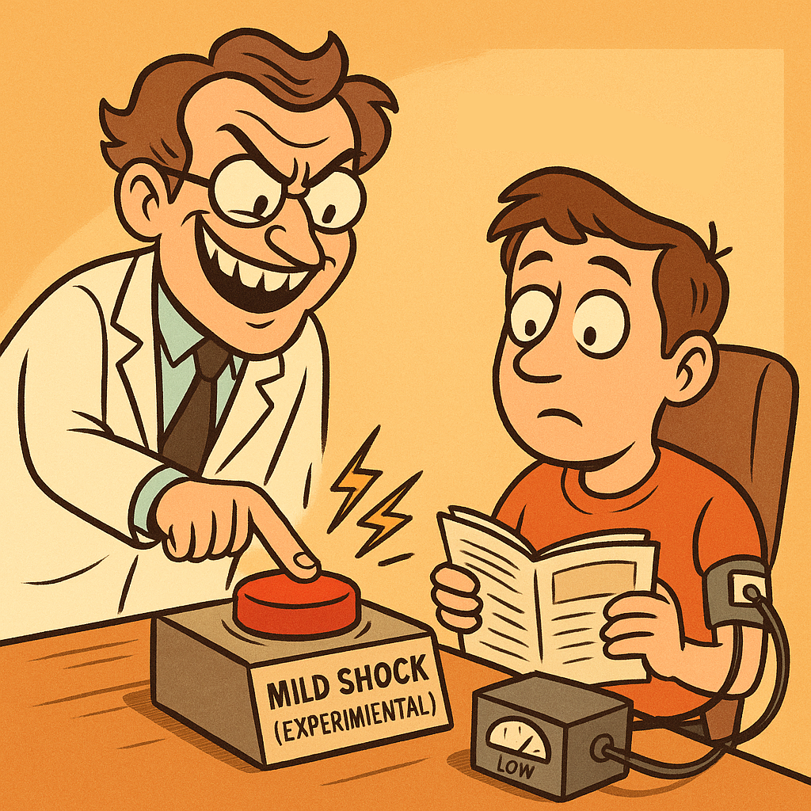
  </fig>
  <fig v-click caption="Norbury et al. (2018)" cite>
    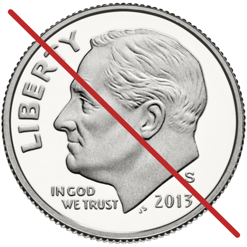
  </fig>

"catastrophic"

Why?

<!-- 

Evidence from explicit probability judgments, revealed preference, and memory probes
suggest that people are hyper-attentive to catastrophic events, whether its a car crash...

Prevalence -> should be a rational

-->

---

# Why think about bad things?

<!-- hard question → let's try an easier one -->

---

# Should you go to the party?

<!-- 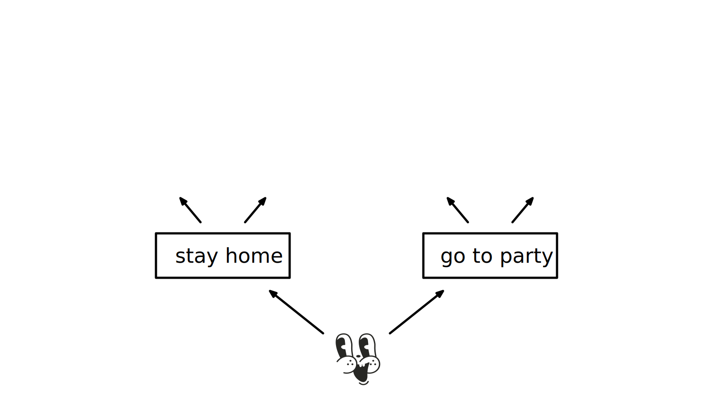 -->

<Pos v-click l=24 y=30 s=15> </Pos>
<Pos v-click l=51 y=30 s=15> </Pos>
<Pos v-click r=51 y=30 s=15> <Text txt=🥰 w20 /> </Pos>
<Pos v-click r=24 y=30 s=15> <Text txt=🤮 w20 /> </Pos>

  <Text txt="..." l40 w10 t17 />
  <Text txt="..." r40 w10 t17 />

<!-- <GridLines /> -->

---

# Should you go to the party?

<Box t=10 x=75 w=120 h=70 v-click="['+1', '+1']">
   
   
probability

   
utility

</Box>

<Box v-click=3 t=30 l=33 w=77 h=36 tilt-l text-red-7 border="~ red-7 15">
  
RATIONAL CHOICE

  <Tex tex="\argmax_a \sum_{o} p(o|a) U(o)" ></Tex>
</Box>

---
outcomes: [+1, 0, -1, 0, +2]
clicks: 6
---

# Should you go to the party? for humans

  <Tex l28 t15 >x_i \sim p(o | a)</Tex>
  <Tex l83 top-10.4 >\hat{Q}(a) = \frac{1}{N} \sum_{i}^N U(x_i)</Tex>

  

  

<PartyDecision :click="$clicks-1" :outcomes="$frontmatter.outcomes" />

<!-- <Box w=100 h=50 x=75 y=50 v-click=7 >
  
</Box> -->

---
outcomes: [+1, 0, -1, +1, 0]
clicks: 5
---

# Should you go to the party? for humans in the real world

  <Tex l28 t15 >x_i \sim p(o | a)</Tex>
  <Tex l83 top-10.4 >\hat{Q}(a) = \frac{1}{N} \sum_{i}^N U(x_i)</Tex>

<PartyDecision dist=skew :click="$clicks" :outcomes="$frontmatter.outcomes" />

---
outcomes: [-3, +1, -2, -5]
clicks: 5
---

<h1>Should you go to the party? 
for clever humans in the real world</h1>

  
"utility-weighted sampling"

  <Tex l28 t15 >x_i \sim p(o | a) \cdot \big| U(o) \big|</Tex>
  <Tex l83 t11>\hat{Q}(a) =\frac{
    \sum_{i}^N 
      U(x_i) / \big| U(x_i) \big|
    }{
      \sum_{i}^N 1 / \big| U(x_i) \big|
    } 
   </Tex>

<!-- <Pointer x=61 y=40 rot=7 color=hotpink v-click/> -->

<PartyDecision dist=skew :click="$clicks-1" :outcomes="$frontmatter.outcomes" uws />

::cite::

Lieder et al. (2018)

---

<Switch>
  <h1>Utility-weighted sampling</h1>
  <h1>Utility-weighted sampling + negative skew</h1>
  <h1>Utility-weighted sampling + negative skew</h1>
</Switch>

  <fig label="possible outcomes" text-baseline>
    <Tex text-baseline tex="\bar{p}(o)" />
    <Switch>
      
      
      
    </Switch>
  </fig>
  <fig text-100pt>×</fig>
  <fig label="extremity bias" text-bias>
    <Tex inline text-bias tex="|U(o)|" />
    
  </fig>
  <fig text-100pt>=</fig>
  <fig label="considered outcomes" text-sample>
    <Tex text-sample tex="\bar{p}(o) \cdot |U(o)|"/>
    <Switch>
      
      
      
    </Switch>
  </fig>

  
realistic outcome distribution

  
extremity bias

  
negativity bias

---

<Switch>
  <Questions question=3 answer=0 highlight=1 />
  <Questions question=3 answer=1 highlight=1 />
  <Questions question=3 answer=1 highlight=2 />
</Switch>

---

# People think about good things

  <fig v-click caption="Callaway, Rangel, Griffiths (2021)" cite>
    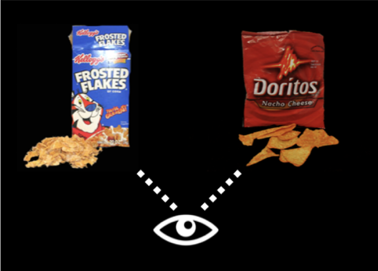
  </fig>
  <fig v-click caption="Callaway, ... Lieder, Griffiths  (2022)" cite>
    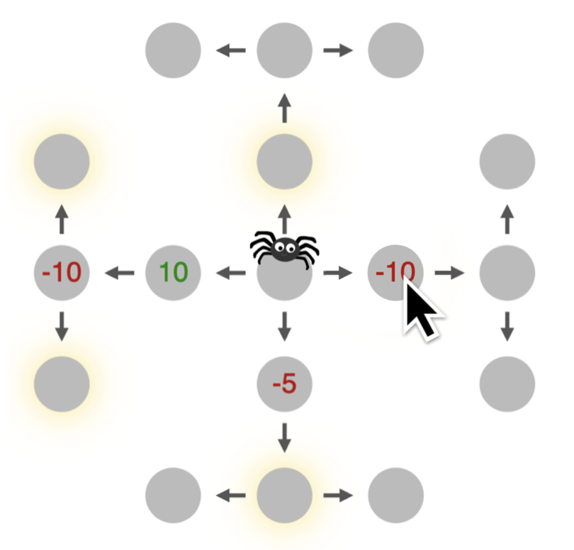
  </fig>

---

# People think about good things

  

  
  - Hours TV per day
  - Honks per week
  - Mins late for appointment
  - Times snooze alarm
  

  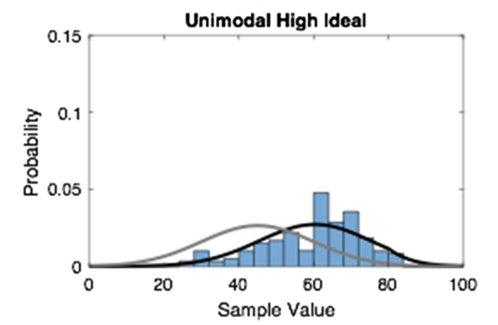

<Box l=0 b=9 w=60 h=17 text-xl tilt-l v-click>
  Things we can control!
</Box>

::cite::
Bear, Bensinger, Jara-Ettinger, Knobe, Cushman (2020)

---

# Should you go to the party?

---

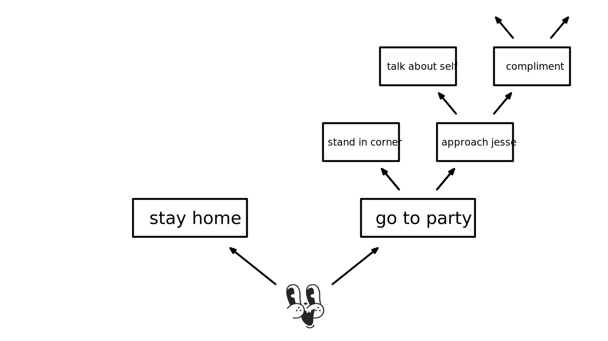

$$\alpha$$

$$1 - \alpha$$

control

---
clicks: 7
---

<h1>How does control affect outcomes?</h1>

<BinTree t8 w20
  :current="['root', 'root', 'R', 'R', 'RR', 'RR', 'RRL', 'RRL'][$clicks]"
  :target="['', 'R', '', 'RR', '', 'RRR'][$clicks]"
/>

slip!

  
{{ r }}

  -6

outcome

---
clicks: 6
---

<h1 v-if="$clicks < 4">How does control affect outcomes?</h1>
<h1 v-else>
  How <em>should</em> control affect
  <!-- How does perceived control affect -->
  sampled outcomes?
</h1>

<CurveVideo t5 
  :show0="$clicks == 0"
  :play="$clicks > 0"
  :path="(
    $clicks < 3 ? '/fig/tree_outcomes/normal-default' : 
    $clicks < 5 ? '/fig/tree_outcomes/normal-fit' : 
    $clicks < 6 ? '/fig/tree_outcomes/skew-fit' :
    '/fig/tree_outcomes/skew-uws'
  )"
/>

  

    possible outcomes
  

  

    achieved outcomes
  

  

    relative probability
    <!-- relative probability -->
    sampling bias
    <!-- relative probability -->
  

  
sampled outcomes

+UWS 

  

    <Tex text-baseline tex="\bar{p}(o)" />
    <Tex text-received tex="p_α(o)" v-click=1 />
  

  

    <Tex inline tex="p_α(o) / \bar{p}(0)" />
    <Tex v-if="$clicks >= 6" inline text-bias tex="e^{\beta U(o)} \cdot |U(o)|" />
    <Tex v-else v-click=3 inline text-bias tex="e^{\beta U(o)}" />
  

  

    <Tex v-if="$clicks >= 6" text-sample tex="\bar{p}(o) \cdot e^{\beta U(o)} \cdot |U(o)|"/>
    <Tex v-else text-sample tex="\bar{p}(o) \cdot e^{\beta U(o)}"/>
  

---

<Switch>
  <Questions question=3 answer=1 highlight=2 />
  <Questions question=3 answer=2 highlight=2 />
  <Questions question=3 answer=2 highlight=3 />
</Switch>

---

<h1> Why do people think about bad things too much? </h1>

<!-- 
some
 -->

  They think they have less control 
  
    than they actually have 

Why?

---

# Why don't people learn they have high control?

fewer experiences

worse experiences

---

# Low perceived control → fewer experiences

---
clicks: 5
---

# Low perceived control → fewer experiences

<CurveVideo t0 :n-frame=76
  :init-frame=49
  :init-direction=-1
  :play="$clicks >= 3"
  :path="(
    $clicks < 4 ? '/fig/avoidance/0.8-9' :
    $clicks < 5 ? '/fig/avoidance/0.6-9' :
    '/fig/avoidance/0.7-9'
  )"
/>
<!-- 
<CurveVideo t0 init-direction=-1
  :name="(
    $clicks < 5 ? 'avoidance-0.7-1' :
    'avoidance-0.75-1-false'
  )"
  :init-frame="$clicks == 0 ? 79 : undefined"
  :n-frame="$clicks < 5 ? 79 : 101"
  :play="$clicks >= 2"
/> -->

<Pointer x=68 y=32 rot=5.8 v-click=4 color=hotpink />

avg reward

approach rate

  
sampled outcomes

  
achieved outcomes

  
approach & reward 

---

# Low perceived control → *worse* experiences

---
clicks: 5
---

# Low perceived control → *worse* experiences

<CurveVideo t0 
  :init-direction=-1
  :init-frame=81
  :path="(
    $clicks < 4 ? '/fig/policy/0.95-1' :
    '/fig/policy/0.75-1'
  )"
  :n-frame=81
  :play="$clicks >= 1"
/>

achieved

predicted

<Pointer x=85 y=55 rot=1 v-click="[3, 4]" color=hotpink />

<Pointer x=68 y=32 rot=5.8 v-click=4 color=hotpink />

  
sampled outcomes

  
achieved outcomes

  
average outcomes

c.f. Randy

<!-- 
 -->

---

---

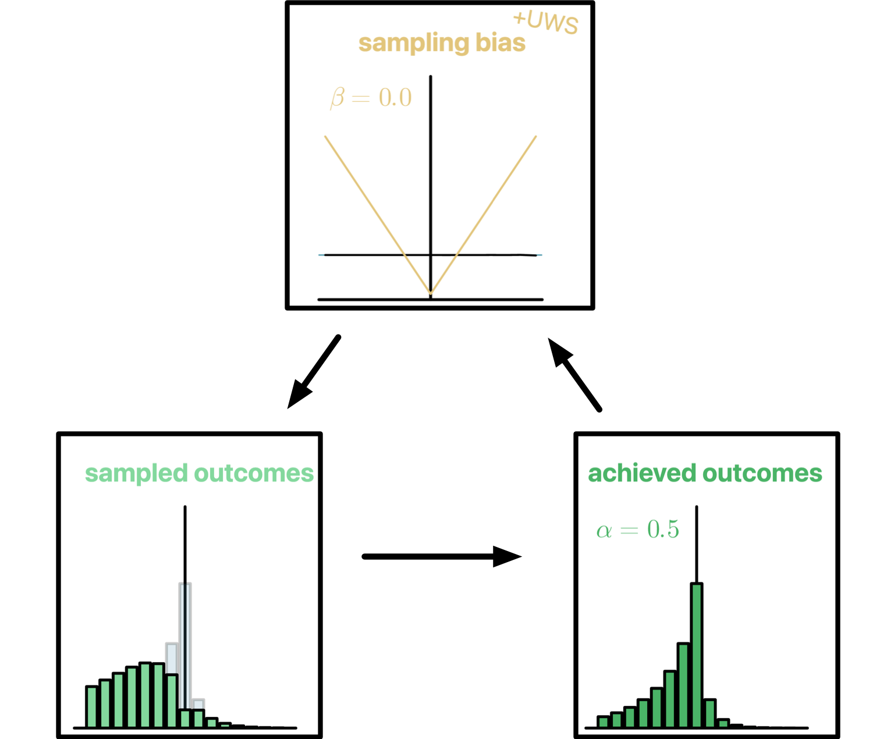

  

---

# Learning your control

<Switch w150>
  

    
    
200 trials

  

  

    
    
300 trials

    
traumatic event

  

</Switch>

---

# Early experience matters

  
  
300 trials

  
traumatic event

---

# Early experience matters a lot

  
  
3000 trials

---

<Switch>
  <Questions question=3 answer=2 highlight=3 />
  <Questions question=3 answer=3 highlight=3 />
  <Questions question=3 answer=3 />
</Switch>

---

# "The bigger picture"

  
computational models can link mental and behavioral symptoms

  
"maladaptive" cognitive traits can arise from adaptive processes

## Open questions {v-click}

  
reward or transition probabilities?

  
helplessness or hopelessness?

  
context-sensitivity & generalization

---

## come work with me!

  
  _and these cool folks too!_
  
  

    

      
      
Jonathan Phillips

    

    

      
      
Steven Frankland

    

  

<a href="mailto:fredcallaway@gmail.com" font-mono r2 b1 text-sm>fredcallaway@gmail.com</a>
https://sites.dartmouth.edu/cogscigrad/
