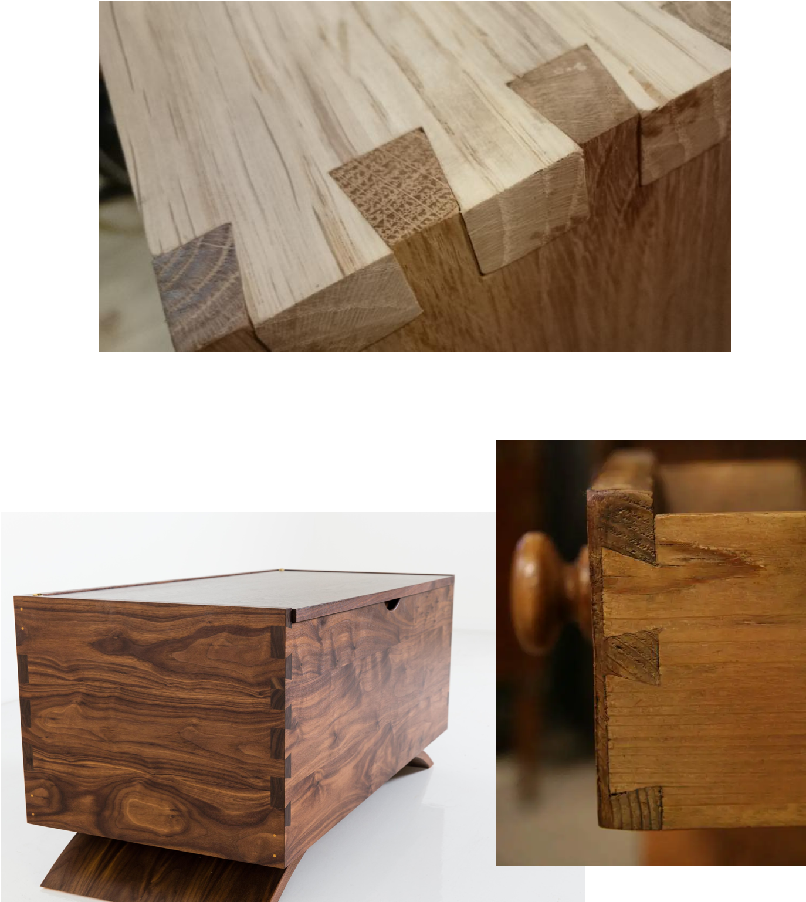
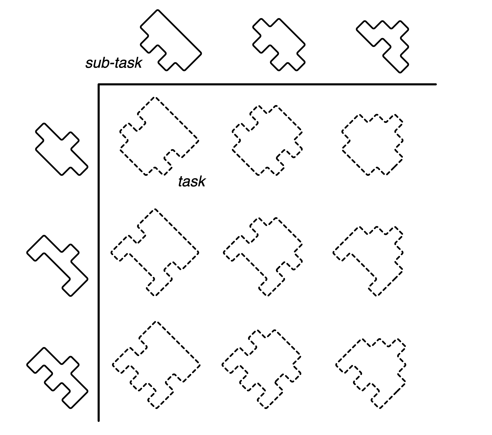
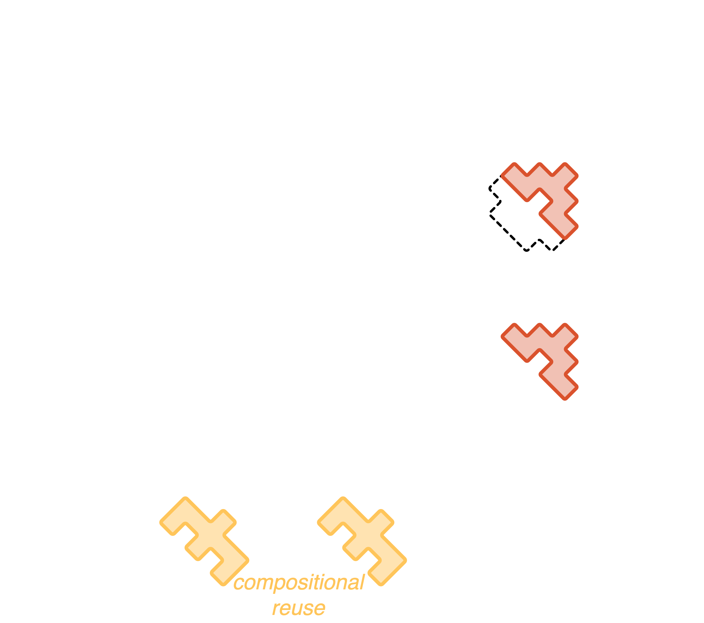
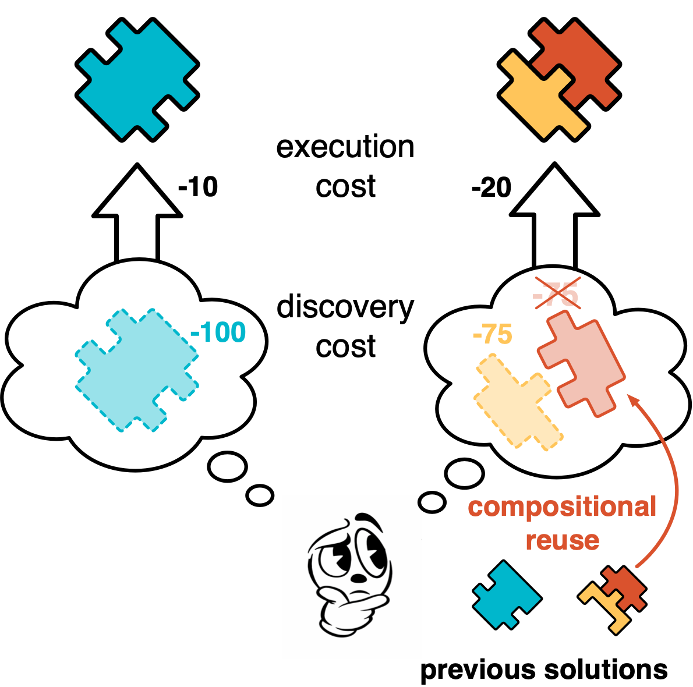
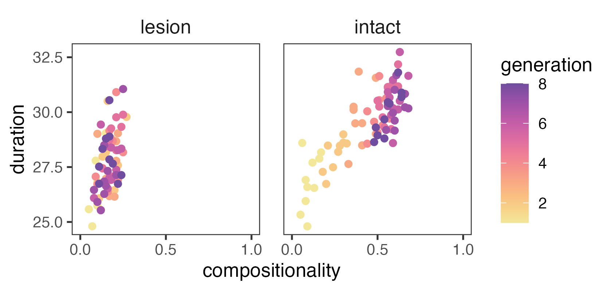

# People are *wildly*{.text-comp} compositional

<v-clicks flex flex-row justify-between w-full > 
  
  
  
</v-clicks>

---

# Modern AI is *mildly*{.text-bespoke} compositional

<v-clicks depth="2">

  - Most "modern" AI systems show limited compositionality
     [lake2017still, dasgupta2018evaluating, hupkes2020compositionality]{.cite}
  - Those that *are* compositional tend to fall into three types:

    - explicit decomposition provided by a human
       [dietterich2000hierarchical, erol1994umcp]{.cite}
    - strong inductive bias for one kind of decomposition
       [chang2017compositional, kansky2017schema]{.cite}
    - learning from compositionally structured demonstrations or curricula
       [luo2023learning, chen2021ask, silver2022inventing, lake2023humanlike]{.cite}

</v-clicks>

---

# A glaring exception

::rcite::
DALL-E (2024)

::cite::
farrell2025large

---

# What's in common here?

  

    
    
  

  
  

  <Box w125 h-20 italic text-3xl bg-black text-white >
  They're all products of culture!
  </Box>

---

<Outline click />

---

<Outline at=1 />

---

# Compositional task space

  

    
    <v-clicks>
      
      
      <!--  -->
    </v-clicks>
  

  
  
  

    

      <Tex tex="S" />
      
environment size

      <Tex tex="K" />
      
number of tasks to solve

      <Tex tex="\lambda_\text{exec}" />
      
compositional execution cost

      <Tex tex="\lambda_\text{disc}" />
      
compositional discovery cost

    

  

---

# The costs and benefits of compositionality

<Switch>
  
  

    
    
  

</Switch>

::rcite::

<Tex text-xs tex="S = 10,\; λ_\text{exec}=0.2,\; λ_\text{disc}=0.5" />

---

# When should an individual be compositional?

::rcite::

<Tex text-xs tex="\lambda_\text{exec}=0.2,\; λ_\text{disc}=0.5" />

---

# When should a *population* be compositional?

   

     too few → unlikely to observe anything relevant
   
     too many → likely to observe bespoke

---

# When *will* a population be compositional?

---

### so, good things evolve? fascinating stuff...

---

# Good things do not always evolve

---

<Outline at=2 />

---

# Code-breaker task

<SimpleFrame src='https://fredcallaway.com/expdemo/machine/exp1/?main=2' />

---

# Compositionality over time

---

# Cost 

---

