<SimpleFrame scale-135 translate-y-13 full
  src="/graphnav-demo/index.html?block=main&fast=1&hover_rewards=0&hover_edges=0&two_stage=0"
  scrolling="no"
  width="700"
  height="800"
  t-2
/>

<Box v-click text-sm l5 t16 w38 tilt-l shadow-xl>
  points and arrows change on every trial
</Box>

<Box v-click text-sm r5 t7 w48 tilt shadow-xl>
  scrambled structure forces internal maintenance of paths and values
</Box>

---

# Eye tracking

<Box r5 t5 tilt w-45 z-1 v-click title="Gaze contingent display">
Reward appears when gaze is nearby
</Box>

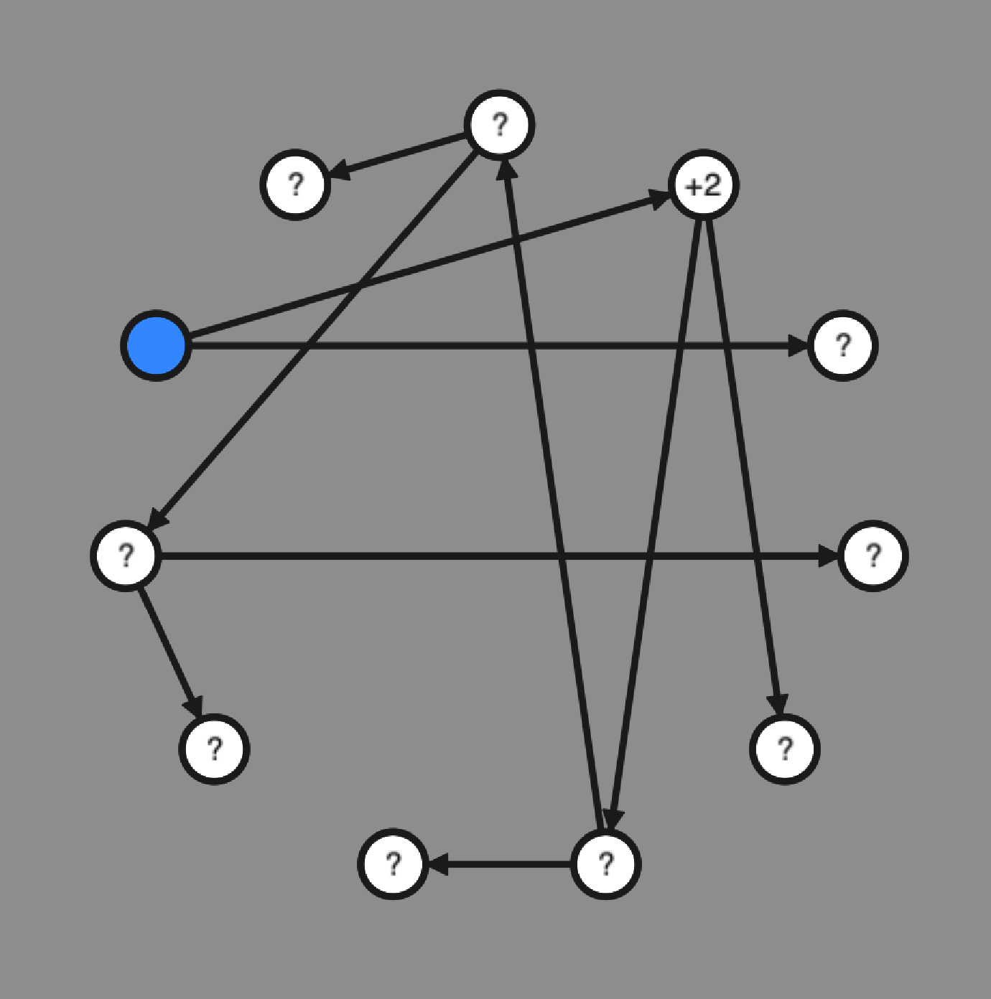

::background::

---

<SlidevVideo full :key=$clicks :autoplay="$clicks == 1" autoreset="slide">
  <source src="./videos/P01-16.mp4" type="video/mp4"/>
</SlidevVideo> 

---

<TrialViewer trials="pid=1&trial=16" />

---

# Basic performance

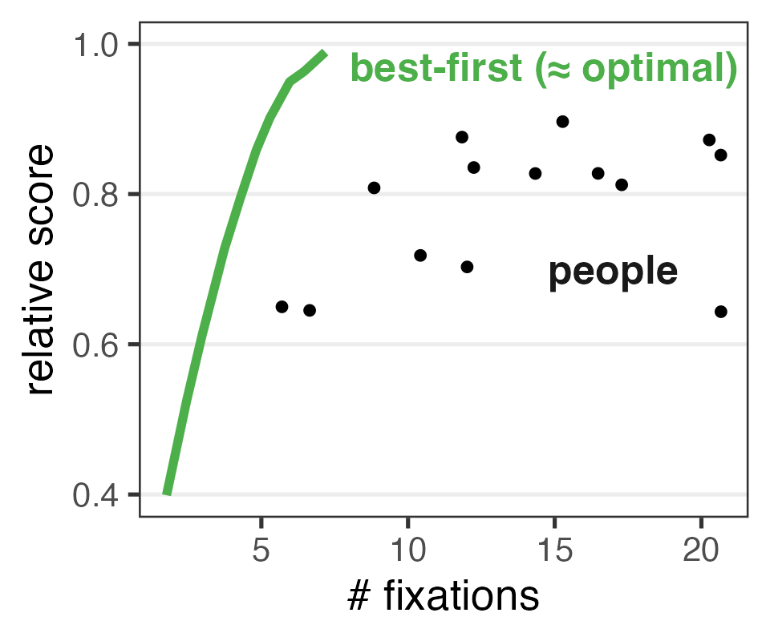

---

## where do people look?

---

# Fixations by depth

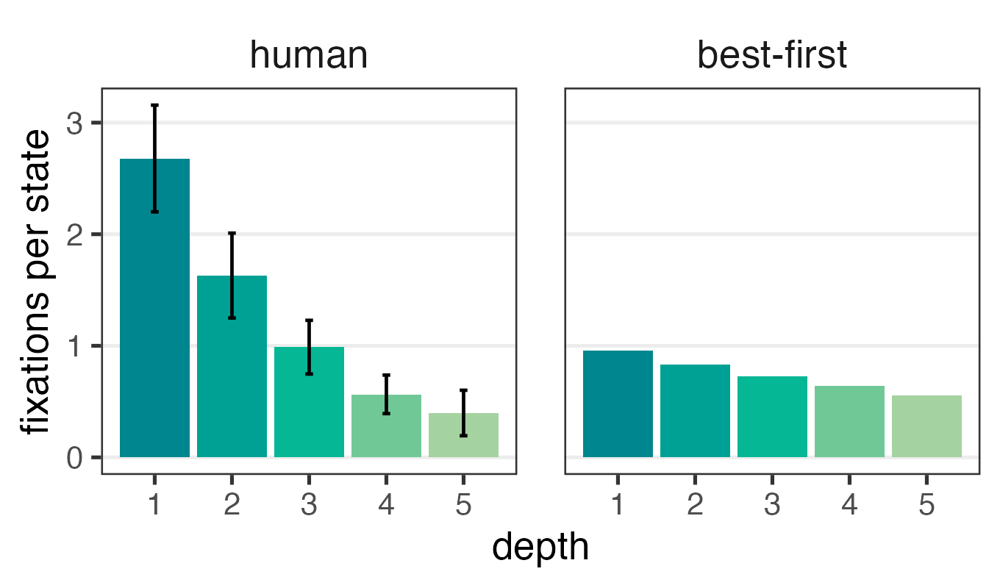

---

# Fixations by reward

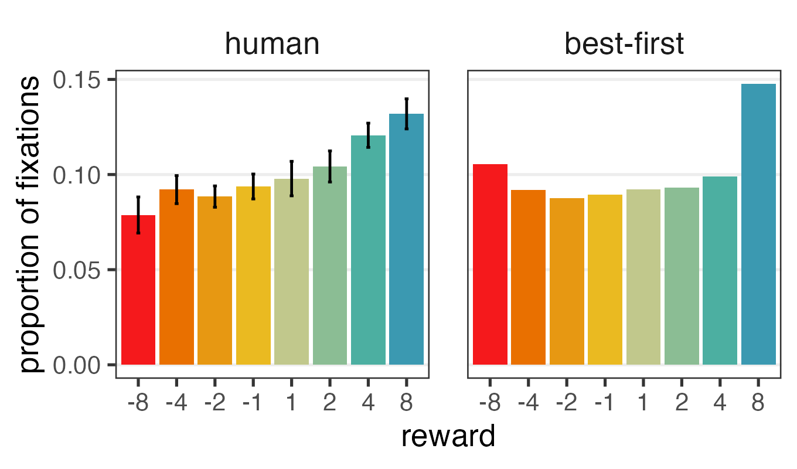

---

### not looking great

---

# Another perspective

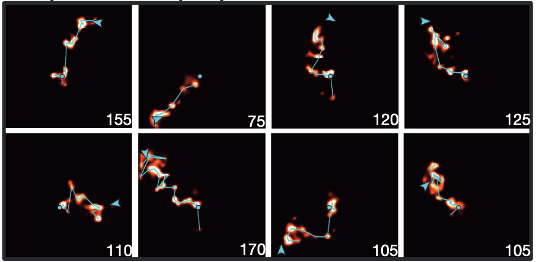

::cite::
Pfeifer & Foster (2013)

---

<TrialViewer trials="pid=2&trial=30&timeline=0"  />

  "rollouts"

---

# Tree-search or rollouts?

  <Fig label="tree search" h-60>
    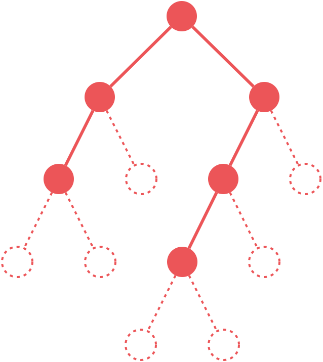
  </Fig>
  <Fig label="rollouts" h-60>
    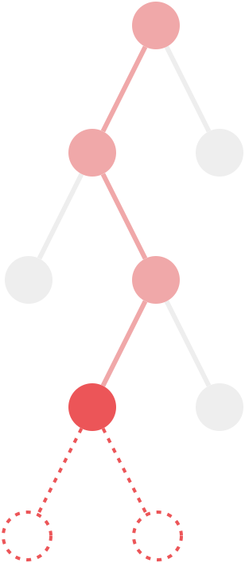
  </Fig>

<Box v-click text-sm l0 t16 w40 tilt-l shadow-xl>
  explicit reasoning about alternatives
</Box>

<Box v-click text-sm r0 t16 w40 tilt shadow-xl>
  implicit learning from simulated experience
</Box>

<Box v-click text-sm l0 b5 w35 tilt shadow-xl>
  fast but  memory-intensive
</Box>

<Box v-click text-sm r0 b5 w35 tilt-l shadow-xl>
  low-memory  but slow
</Box>

---

# Fixations by depth

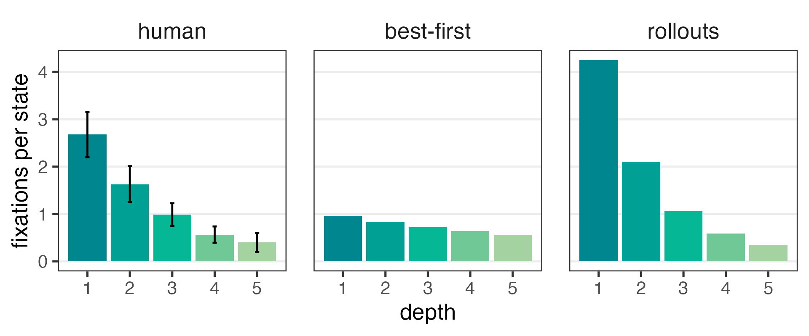

---

# Fixations by reward

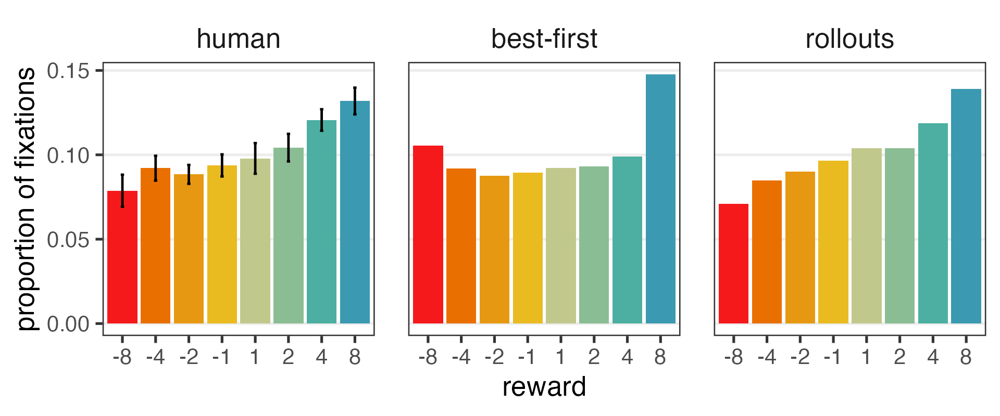

---

### rollouts look pretty good

---

## where do people look _next_? 

---

# Keep it in the family

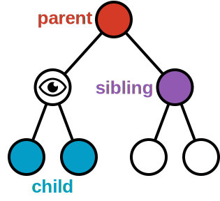

---

# Saccades reflect local search

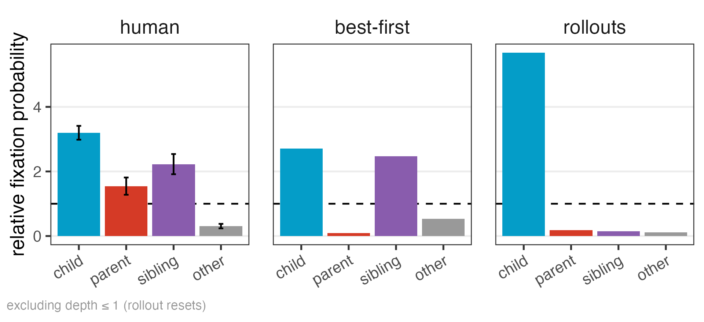

---

# Child or sibling?

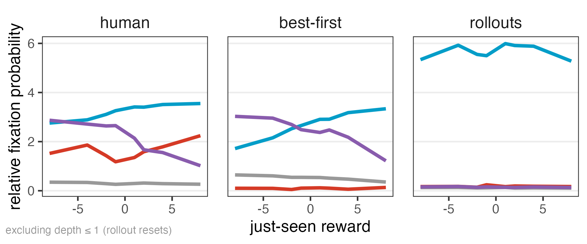

---

### well now it looks more like best-first

---

# Sophie's Choice (which child?)

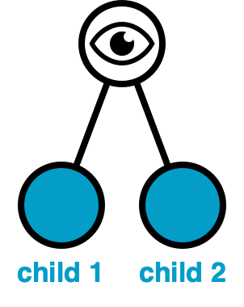
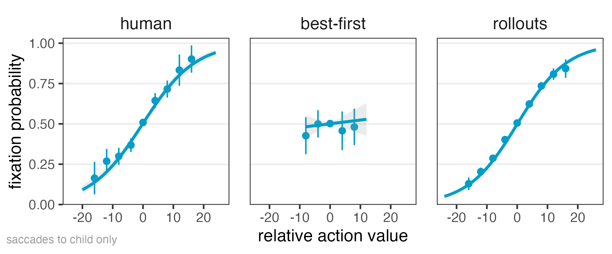

---

# Depth over time

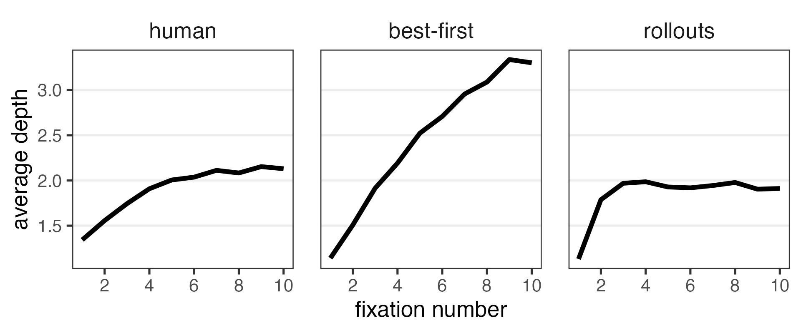

---

<h3 class="!text-3xl">...</h3>

---

## is there something in between?

---

# What's in between

  <Fig label="rollouts" h-60>
    
  </Fig>
  <Fig label="???" h-60 v-click >
    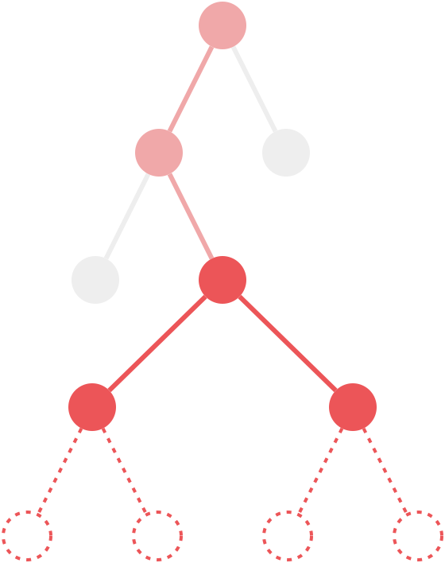
  </Fig>
  <Fig label="tree search" h-60>
    
  </Fig>

---
hide: true
---

# Best-first search with limited memory

  <Fig label="capacity 1" h-60>
    
  </Fig>
  <Fig label="capacity 3" h-60>
    
  </Fig>
  <Fig label="capacity ∞" h-60>
    
  </Fig>

---

# Best-first search with limited memory

<v-click>

**Working memory** holds a **decision tree**
</v-click>

- tracks exact path values and a search frontier {v-click}
- hard capacity constraint {v-click}
- best-first search {v-click}

<v-click>

**Short-term memory** (?) holds a **value function**
</v-click>

- tracks statistical state-reward associations {v-click}
- no capacity constraint, but inexact learning {v-click}
- RL-style exploration (UCB) {v-click}

---

# Fixations by depth

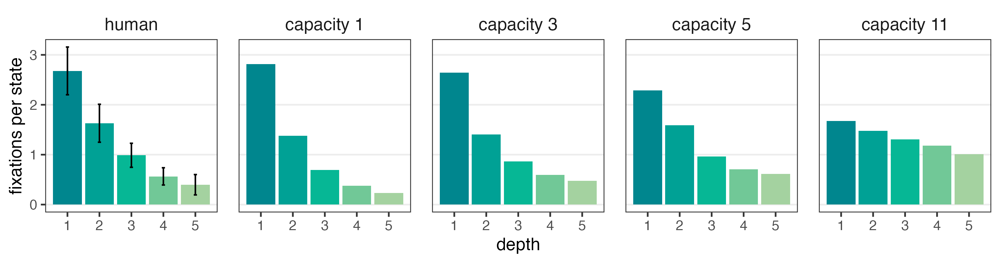

---

# Fixations by reward

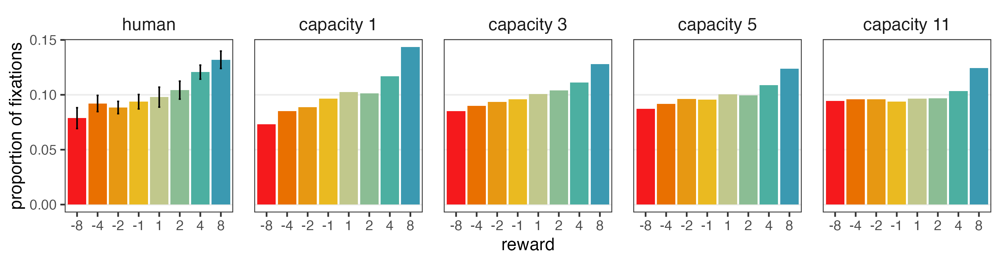

---

# Local search

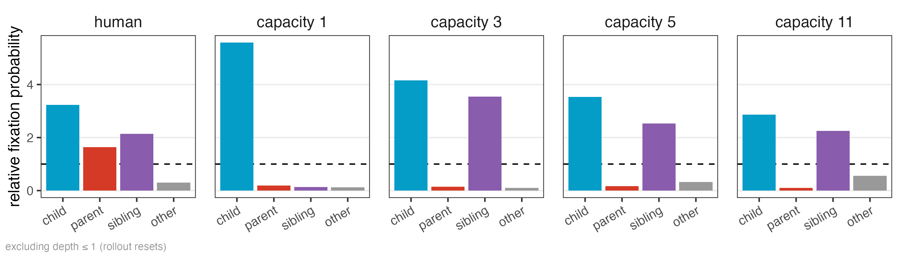

---

# Child or sibling?

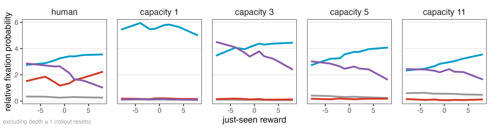

---

# Which child?

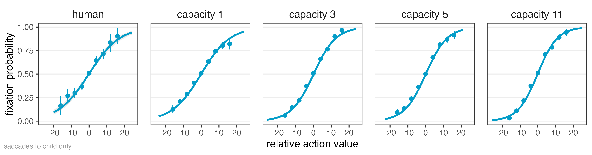

---

### they all look the same

---

# Depth over time

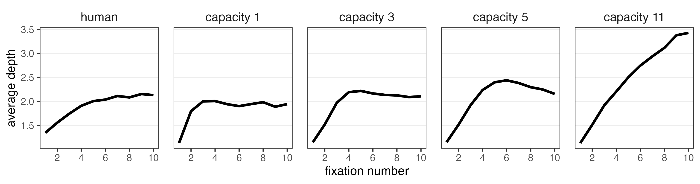

---

# Distant relatives

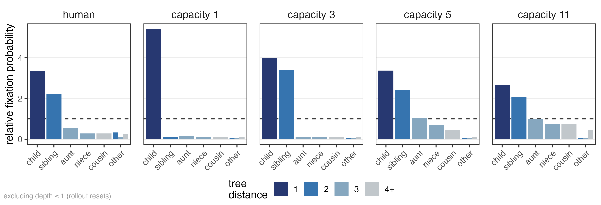

---

# Pruning?

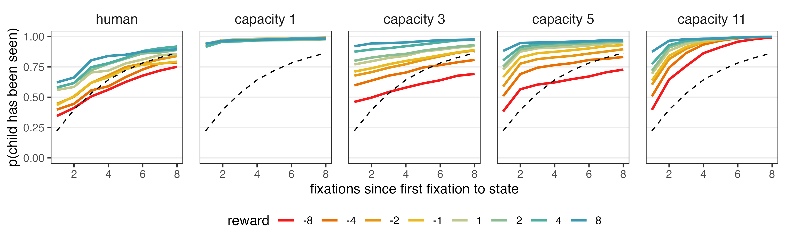

<Pointer x=29 y=40 rot=5.5 v-click=1 />
<Pointer x=85 y=40 rot=5.5 v-click=1 />

::cite::
c.f. huys2012bonsai
