# Example: route-planning

::background::

<Switch>
  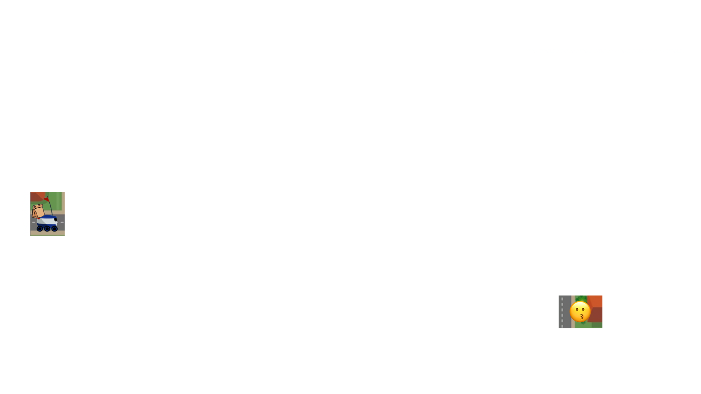
  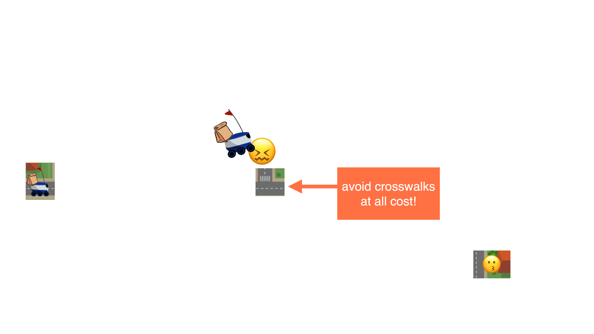
  
</Switch>

---

# Example: route-planning

::background::

Time: 

<TimeBar :duration="10000" t9 l100/>

---

### time's up! {.text-xs}

---

# Tree search

::background::

<Switch>
  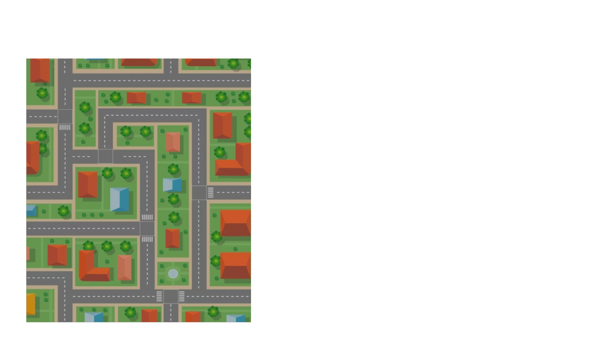
  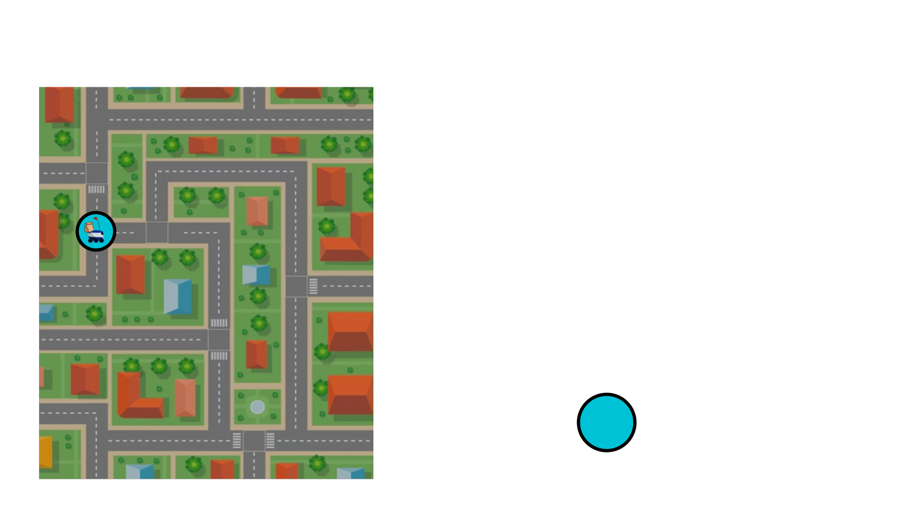
  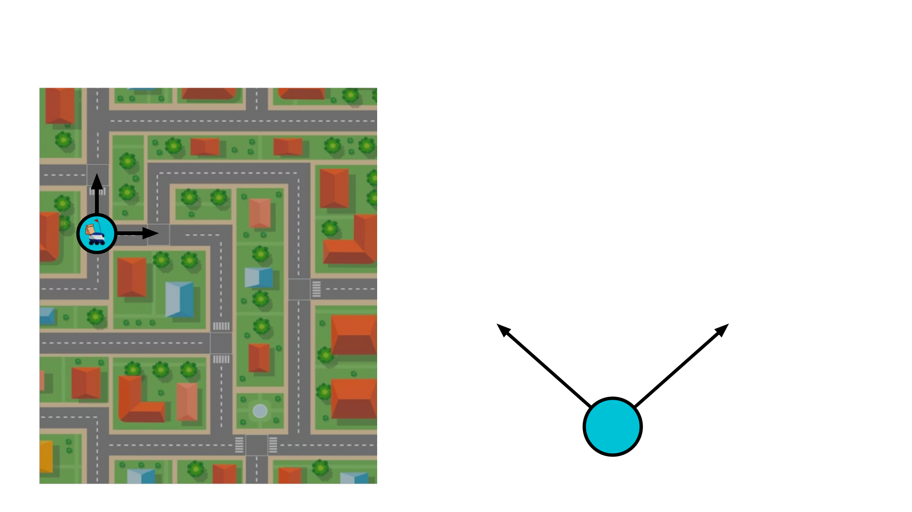
  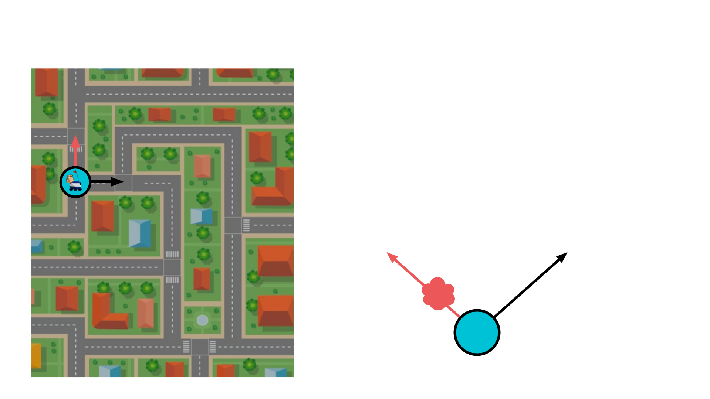
  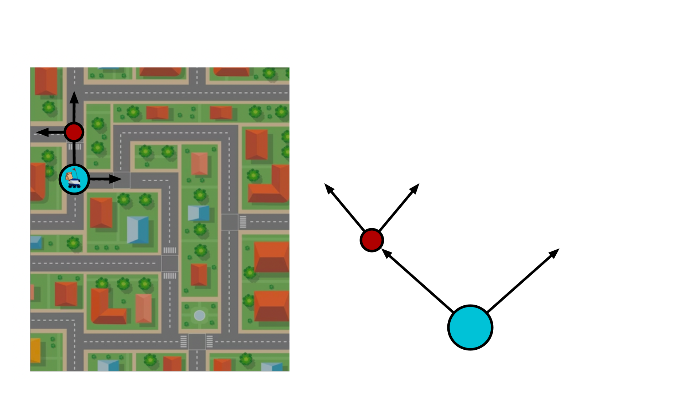
  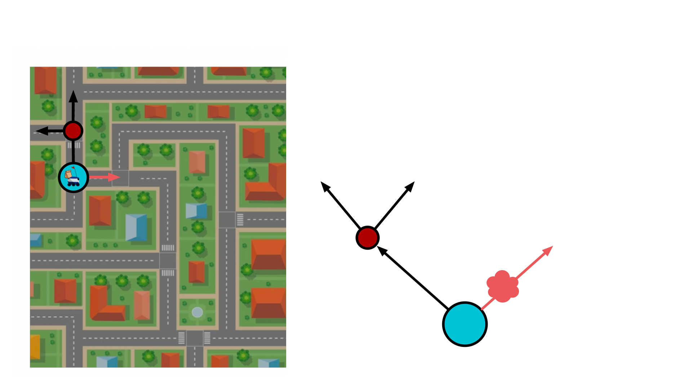
  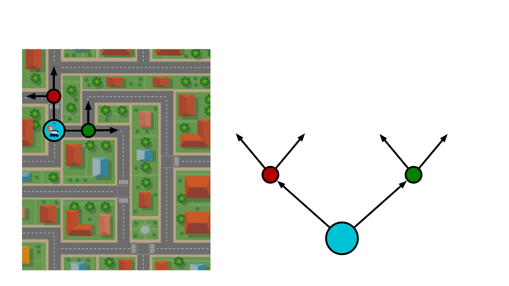
  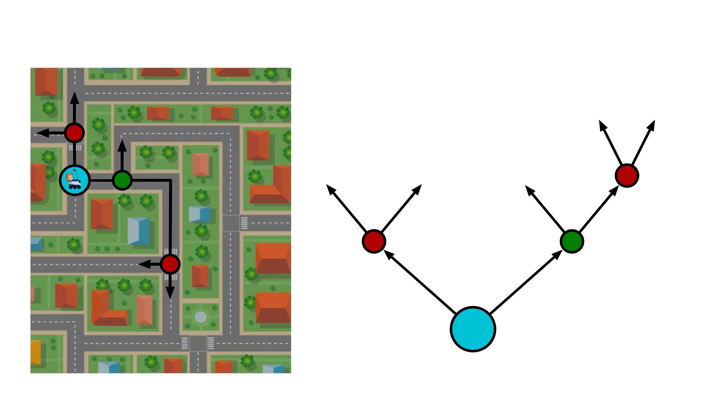
  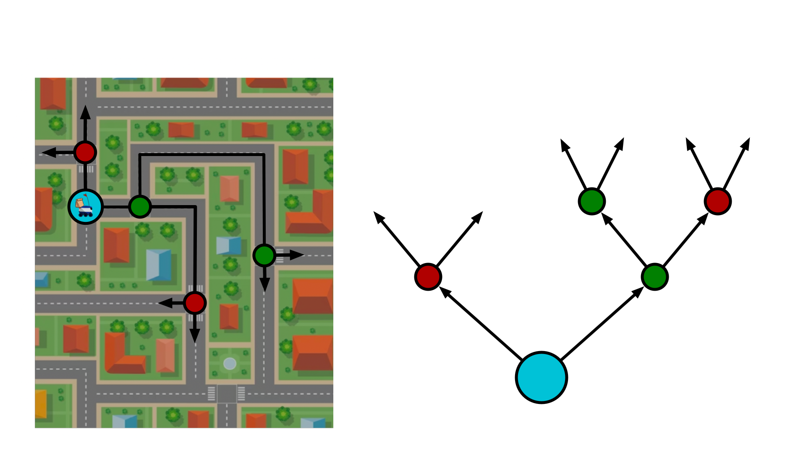
  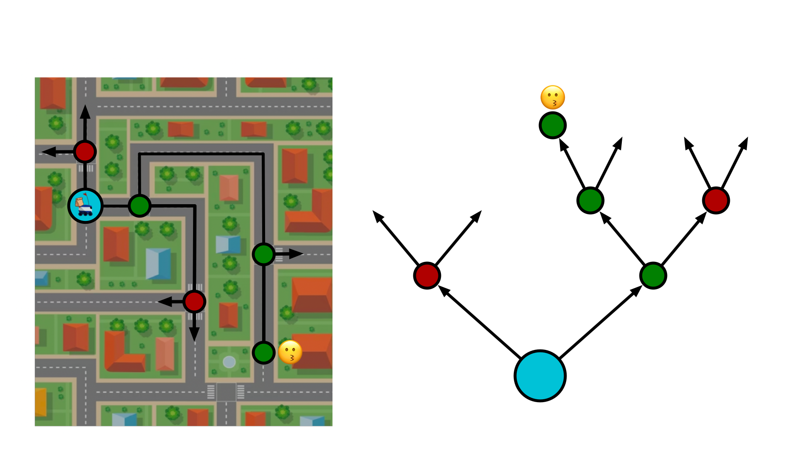
  

    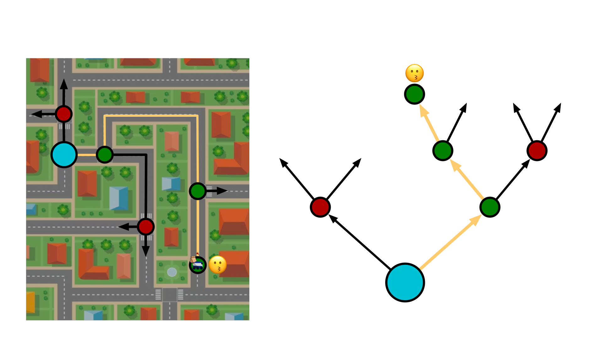
    
act!

  

</Switch>

---

# The problem

<Box v-drag="[415,108,500,190,8]" v-click=1 >
  Which action do you consider next?
</Box>

::background::

<Switch>
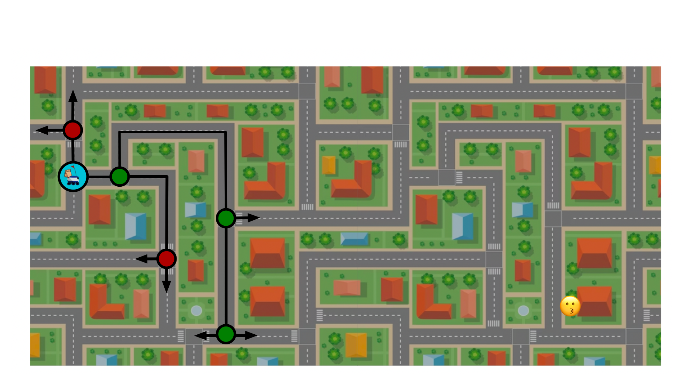

</Switch>

---

# The solution

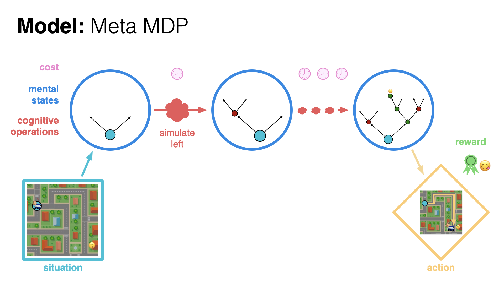

