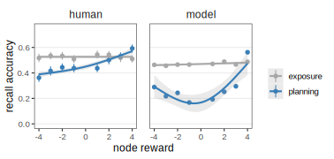
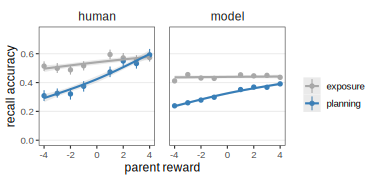

---

# WM maintenance for planning

<Profile name="Zhuojun Ying" src="/people/zhuojun.avif"  />

---

# Iterated rate-distortion for planning

<Profile name="Zhuojun Ying" src="/people/zhuojun.avif"  />

<Box r48 b24 w37 tilt shadow-xl italic>
  variational RNN
</Box>

::rcite::
in CogSci 2024 & 2025

---

# Better memory for larger rewards

<TreeRelationships height=2 query=LL highlight=LL b0 r0 />
<Profile name="Zhuojun Ying" src="/people/zhuojun.avif"  />

---

# Parent reward facilitates memory for child

<TreeRelationships height=2 query=LL highlight=L b0 r0 />
<Profile name="Zhuojun Ying" src="/people/zhuojun.avif"  />

---

# "Aunt" reward inhibits memory

<TreeRelationships height=2 query=LL highlight=R b0 r0 />
<Profile name="Zhuojun Ying" src="/people/zhuojun.avif"  />
