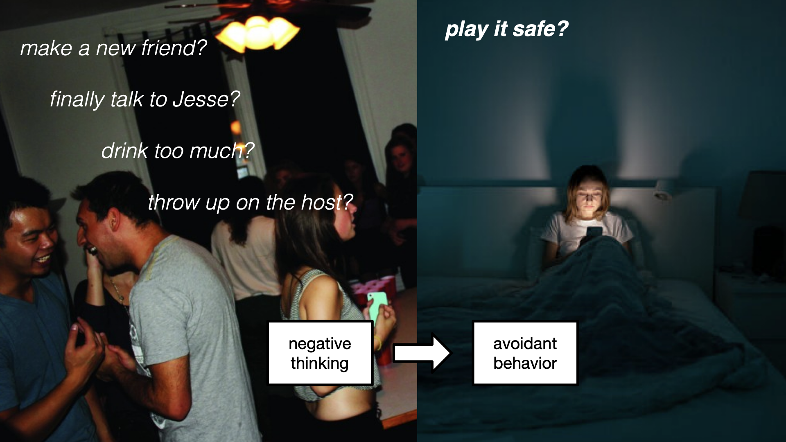
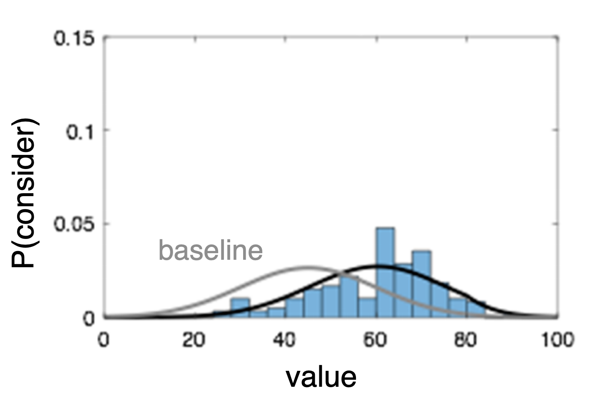

# A rational model of perceived control negative thinking, and avoidance

---

---

# Three questions

1. Why do people think about bad things?
2. Why do people think about good things?
3. Why do some people think about bad things too much?

---

# People think about bad things

- car crashes(Christianson & Loftus, 1987)
- shocks (Sunstein & Zeckhauser, 2011)
- prediction errors (Rouhani et al., 2018)

<!-- img/shock.png -->

<!-- 

Evidence from judgments, memory recall, and incentivized choice suggest that people over-weight catastrophic events, whether its a car crash...

Prevalence -> should be a rational

-->

---

---

---

---

<Switch>

  <Box l=0 t=0 w=80 h=40 text-sm justify-between flex-col>

  ## rational choice
  $$ \sum_{o} p(o) U(o) > 0 $$

  _expected utility_
  </Box>

  <Box l=0 t=0 w=80 h=40 text-sm justify-between flex-col>

  ## bounded-rational choice
  $$ \frac{1}{N} \sum_{i}^N U(x_i) > 0,\quad x_i \sim p(o) $$
  _sampling_
  </Box>

  <Box l=0 t=0 w=80 h=40 text-sm justify-between flex-col>

  ## resource-rational choice
  $$ \sum_{i}^N \text{sign}(x_i) > 0,\quad x_i \sim p(o) \cdot \big| U(o) \big| $$

  _utility-weighted sampling_

  </Box>

</Switch>

---

# Utility-weighted sampling

  <fig label="possible outcomes">
    
  </fig>
  <fig text-100pt>×</fig>
  <fig label="utility-weighted sampling">
    
  </fig>
  <fig text-100pt>=</fig>
  <fig label="considered outcomes">
    
  </fig>

---

### where's the negativity bias?

---

# Utility-weighted sampling

  <fig label="possible outcomes">
    
  </fig>
  <fig text-100pt>×</fig>
  <fig label="utility-weighted sampling">
    
  </fig>
  <fig text-100pt>=</fig>
  <fig label="considered outcomes">
    
  </fig>

<Pointer x=35 y=54 rot=1 v-click color=red />

---

# Utility-weighted sampling + negative skew

  <fig label="possible outcomes">
    
  </fig>
  
×

  <fig label="utility-weighted sampling">
    
  </fig>
  
=

  <fig label="considered outcomes">
    
  </fig>

::bottom::

  
realistic outcome distribution

  
extremity bias

  
negativity bias

---

## why doesn't everyone do this?

---

# People think about good things

<!--  -->

- blurting things out bear
- causal judgments Icard...Knobe
- what is "normal" Bear & Knobe
- value-directed attention (gluth, anderson, me)
- attention/planning (me?)

---

# People think about good things

---

what's in common? it's things we can control!

---

---

$$\alpha$$

$$1 - \alpha$$

control

---
clicks: 6
---

<h1 v-if="$clicks < 4">How does control affect outcomes?</h1>
<h1 v-else>
  How <em>should</em> control affect
  <!-- How does perceived control affect -->
  sampled outcomes?
</h1>

<CurveVideo t5 
  :show0="$clicks == 0"
  :play="$clicks > 0"
  :name="(
    $clicks < 3 ? 'normal-default' : 
    $clicks < 5 ? 'normal-fit' : 
    $clicks < 6 ? 'skew-fit' :
    'skew-uws'
  )"
  :nFrame="$clicks < 6 ? 99 : 50"
/>

  

    possible outcomes
  

  

    achieved outcomes
  

  

    relative probability
    <!-- relative probability -->
    sampling bias
    <!-- relative probability -->
  

  
sampled outcomes

+UWS 

  

    <Math text-baseline tex="\bar{p}(o)" />
    <Math text-received tex="p_α(o)" v-click=1 />
  

  

    <Math inline tex="p_α(o) / \bar{p}(0)" />
    <Math v-if="$clicks >= 6" inline text-bias tex="e^{\beta U(o)} \cdot |U(o)|" />
    <Math v-else v-click=3 inline text-bias tex="e^{\beta U(o)}" />
  

  

    <Math v-if="$clicks >= 6" text-sample tex="\bar{p}(o) \cdot e^{\beta U(o)} \cdot |U(o)|"/>
    <Math v-else text-sample tex="\bar{p}(o) \cdot e^{\beta U(o)}"/>
  

---
clicks: 1
---

# How does perceived control affect predictions?

<CurveVideo t5 
  :play="$clicks > 0"
  name="skew-uws"
/>

---

# Why do some people think about bad things too much?

they think they have less control

"too much" -> less than they actually have

learning

- less data
- worse performance
- unrealistic expectations

---

- captures helplessness and hopelessness
- unifies reward-based and transition-based notions of control

