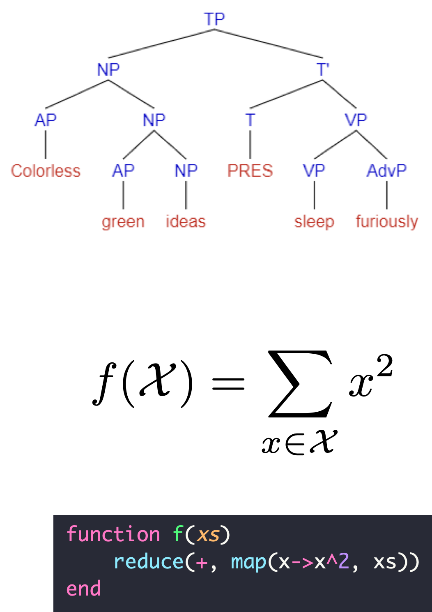
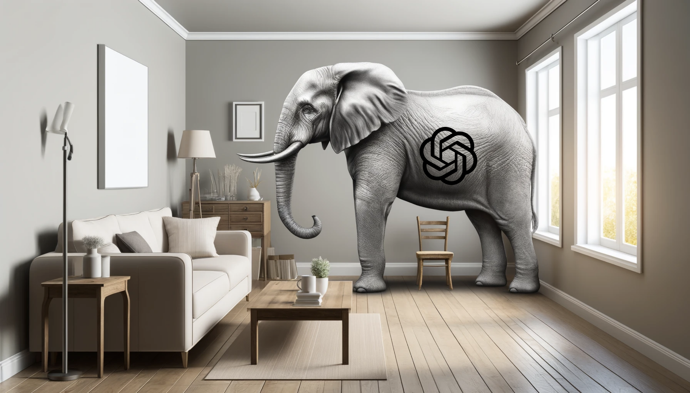

# cultural evolution of compositional problem solving

---

# People are *wildly*{.text-comp} compositional

<v-clicks flex flex-row justify-between w-full > 
  
  
  
</v-clicks>

---

# Modern AI is *mildly*{.text-bespoke} compositional

<v-clicks depth="2">

  - Most "modern" AI systems show limited compositionality
     [lake2017still, dasgupta2018evaluating, hupkes2020compositionality]{.cite}
  - Those that *are* compositional tend to fall into three types:

    - explicit decomposition provided by a human
       [dietterich2000hierarchical, erol1994umcp]{.cite}
    - strong inductive bias for one kind of decomposition
       [chang2017compositional, kansky2017schema]{.cite}
    - learning from compositionally structured demonstrations or curricula
       [luo2023learning, chen2021ask, silver2022inventing, lake2023humanlike]{.cite}

</v-clicks>

---

# A glaring exception

::rcite::
DALL-E (2024)

::cite::
farrell2025large

---

# What's in common here?

  

    
    
  

  
  

  <Box w125 h-20 italic text-3xl bg-black text-white >
  They're all products of culture!
  </Box>

---

<Outline click />

---

<Outline at=1 />

