# cognition as action

Fred Callaway

NYU & Harvard

<Box w30 l100 b19 tilt text-dartmouth border-dartmouth text-lg>
  starting fall '26
  Dartmouth!
</Box>

---
src: ./pages/intro/intro.md
hide: true
---

---

<Outline click/>

---

<Outline at=1 />

---
src: ./pages/theory/theory.md
hide: false
---

---

<OutlineTransition at=2 />

---
src: ./pages/attention/attention.md
hide: false
---
---

<OutlineTransition at=3 />

---
src: ./pages/planning/planning.md
hide: false
---

---
src: ./pages/planning22/planning22.md
hide: false
---
---

<OutlineTransition at=4 />

---
src: ./pages/eyeplan/eyeplan.md
hide: false
---

---

## what next?

---

# Learning representations for planning

<Profile name="Sixing Chen" src="/people/sixing.png" />

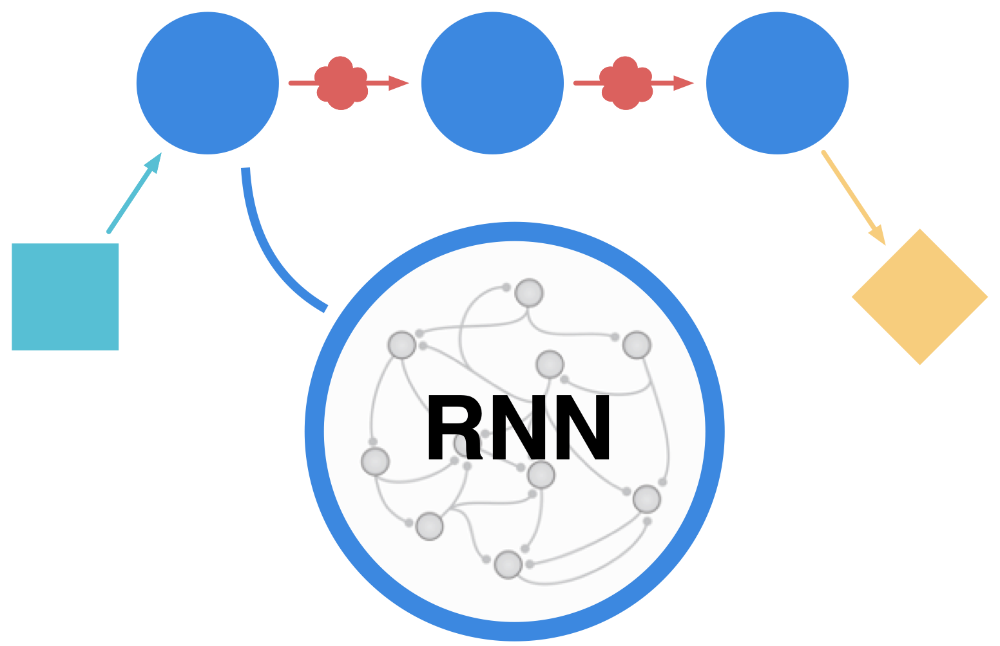

---

# Learning representations for planning

<Profile name="Sixing Chen" src="/people/sixing.png" />

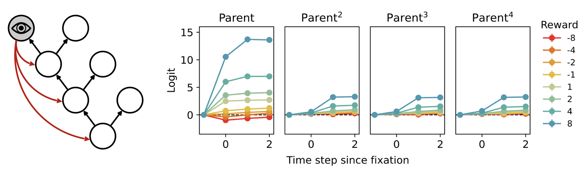

<Pointer x=110 y=46 rot=-1 v-click/>

<Box text-sm r5 b2 w31 tilt-l shadow-xl v-click>
  predecessor representation?
</Box>

---

# WM maintenance for planning

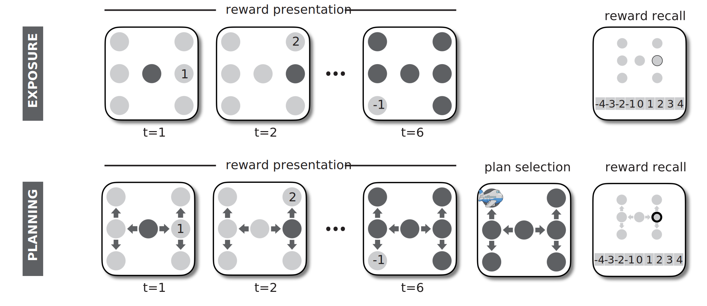

<Profile name="Zhuojun Ying" src="/people/zhuojun.avif"  />

---

# Iterated rate-distortion for planning

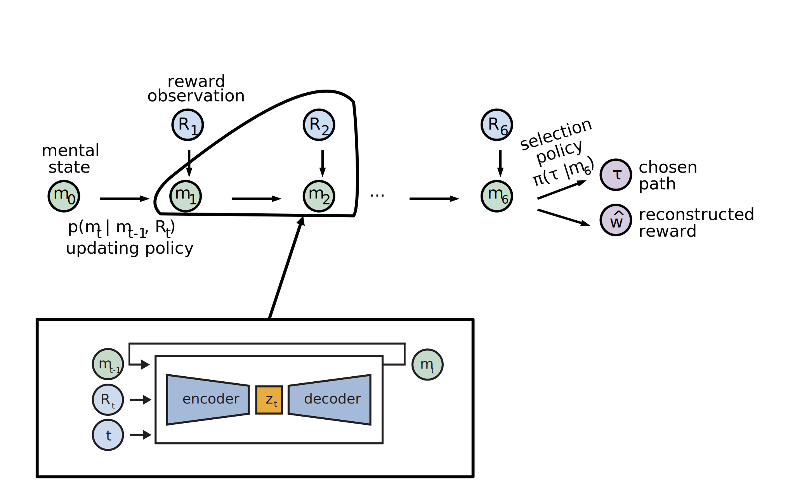
<Profile name="Zhuojun Ying" src="/people/zhuojun.avif"  />

<Box r48 b24 w37 tilt shadow-xl italic>
  variational RNN
</Box>

::rcite::
in CogSci 2024 & 2025

---

# Better memory for better paths

  

    
participants

    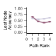

  

    
model

    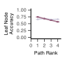

<Profile name="Zhuojun Ying" src="/people/zhuojun.avif"  />

  exposure
   
  planning

---

# Parent reward facilitates memory for child

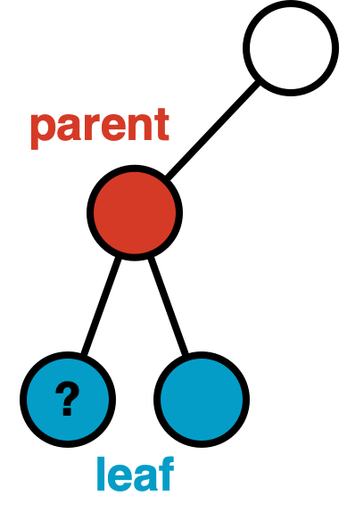

  

    
participants

    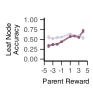

  

    
model

    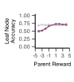

<Profile name="Zhuojun Ying" src="/people/zhuojun.avif"  />

  exposure
   
  planning

---

# Cultural evolution of compositional abstractions

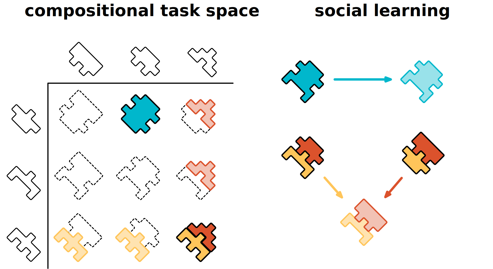

<!-- 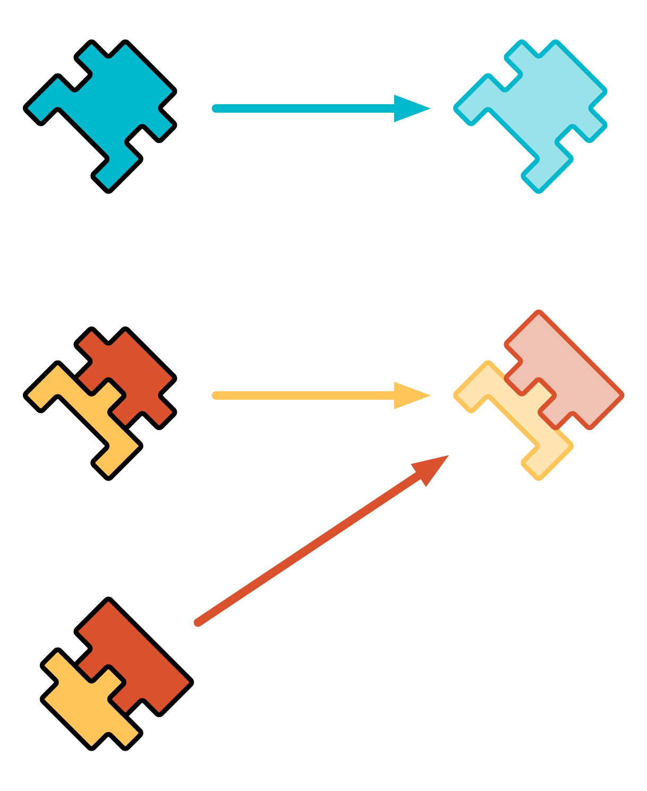 -->

---

### is that it?

---

## Nope!

<Box v-click l16 t15 tilt-l label="computational psychiatry"  />
<Box v-click r15 t30 rotate-15 label="metacognitive control of memory recall" />
<Box v-click l30 t60 rotate-5 label="computer-assisted decision making" />

---

## come work with me!

  
  _and these cool folks too!_
  
  

    

      
      
Jonathan Phillips

    

    

      
      
Steven Frankland

    

  

fredcallaway@gmail.com

---

### that's all folks!